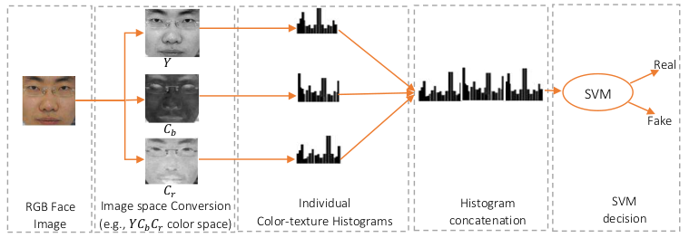
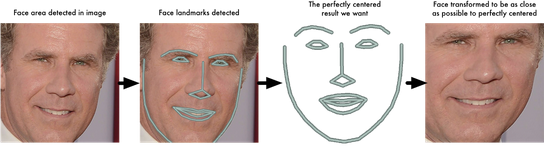
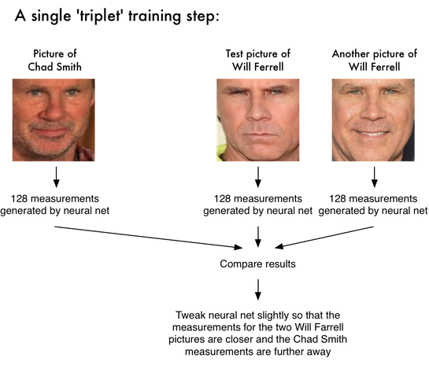
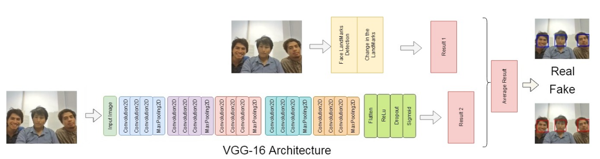
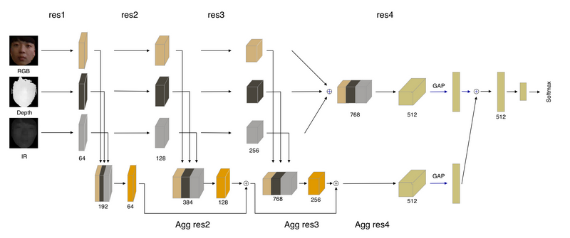

### Method given in Read 1 whose GitHub repositories are available

| Liveness Detection Method     | How it detects Face-liveliness | Description                                                                                | GitHub repo Description                                                                                                                                                                   | GitHub Link                                                                       |
|----------------------------------------------------------|------------------|--------------------------------------------------------------------------|-------------------------------------------------------------------------------------------------------------------------------------------------------------------------------------------|-------------------------------------------------------------------------------------|
| Liveness Detection using Color texture analysis    |  It **takes in an image, performs image space converison, develops individual histograms, performs histogram concatenation** and Finally, the binary classification is performed using **SVM**  | Uses Color Texture analyses for Anti-Spoofing detection                                    | Implemented in C++, exploits the joint color texture information from the luminance and the chrominance channels by extracting low-level feature descriptions from different color spaces | https://github.com/wuyongchn/Face-Spoofing-Detection-or-Face-Liveness-Detection     |  |
| Combination of Standard Techniques based analysis    | It takes the image as the input. It uses the **Landmark technique which marks specific points in the face and later uses this transformation to classify people**. Since everybody will have a different distance between two eyes, it treats this measurement as embedding and if they are too close to each other in the multidimensional space, we can they are the same person and vice versa.   | Uses Keras, OpenCV, and face_recogniition library                                                    | Consists of pre-trained model uses standard techniques and displays liveness score on-screen when run                                                                                        | https://github.com/AhmetHamzaEmra/Intelegent_Lock |  |

### Proposed approach for Color-Texture Analysis 

#### Method 1

#### Method 2
Basic pipeline for detecting faces:
1. Find face in image.
2. Analyze facial features.
3. Compare against known faces.
4. Make a prediction.  

  
[Reference](https://medium.com/@ageitgey/machine-learning-is-fun-part-4-modern-face-recognition-with-deep-learning-c3cffc121d78)

### Methods using Pretrained model for detecting liveness
| Liveness Detection Method          | How it detects face-liveliness  | Description                                                                                | GitHub repo Description                                                                                                                                                                   | GitHub Link                                                                         |
|----------------------------------------------------------|----------------|--------------------------------------------------------------------------------------------|-------------------------------------------------------------------------------------------------------------------------------------------------------------------------------------------|-------------------------------------------------------------------------------------|
| Face anti-spoofing pre-trained model    |  The **videos used for training are split into frames. These frames are in RGB and they are passed to a ResNet18 model. Also, rPPG features are extracted from these frames and passed to a Dense layer**. These two models are then merged together. While testing the live images are passed to the pre-trained model, when a face is detected, the frame with rPPG are passed to the model and the prediction result is calculated.  | Keras based model to detect spoofing                                                       | Here frames are passed to ResNet18 model, the results can be tested using live photos from webcam (Implemented in Python)                                                                 | https://github.com/Emadeldeen-24/face-anti-spoofing                                 |
| Landmark detection and blinking based analysis      | First, it **detects the landmark values** of the face found in the image. Then, those values are analyzed in order to **determine how they change over time according to a series of face expressions the person is asked to do in front of the camera**, like opening their mouth or blinking. The **printed or digital face photos would produce minimum changes** in the landmarks values, only the location of face marks would change but not the face expression itself, the result of this is an **initial decision if the face is real or not**. On the otherhand, **the original image is used as the input of the Deep Learning CNN** and this returns a **second decision**. Finally, using these 2 initial decisions, we take the average value and then round it       | Transfer Learning Model on VGG16, ResNet 50 architecture with ImageNet weights and FaceNet | Contains the weights and python file for implementation                                                                                                                                   | https://github.com/renatocastro33/Transfer-Learning-Face-Anti-Spoofing-Attack-Model |

### Proposed approach for method 4 (Landmark detection and blinking based analysis)

### Methods with implementation in Matlab
| Liveness Detection Method     |  How it detect face -liveliness   | Description                                                                                | GitHub repo Description                                                                                                                                                                   | GitHub Link                                                                         |
|----------------------------------------------------------|--------- |-----------------------------------------------------------------------------------|-------------------------------------------------------------------------------------------------------------------------------------------------------------------------------------------|-------------------------------------------------------------------------------------|
| Directional local binary pattern (DLBP) - Texture Based Analysis   | **DLBP is used to investigate the noise characteristics of the facial image**. By using directional difference filtering, the discrepancies between the real face and the facial artefact (Images/ Videos) in **terms of the consistency of adjacent pixels are exploited**. With the DLBP feature, the detection is accomplished by using a Softmax classifier.           | Provides a simple implementation of DLBP in face anti-spoofing                             | Implementation in Matlab                                                                                                                                                                  | https://github.com/pp21/DLBP-for-Face-PAD                                           |
| Chromatic co-occurrence of local binary pattern (CCoLBP) -Texture Based Analysis | It is used to investigate the inter-channel based information. By **combining intra-channel based facial texture and CCoLBP feature**, the **differences of color distortion and texture distribution between the real faces and the artefacts (Images/ Videos) are characterized**. With these features, the detection is accomplished by using a **Softmax classifier**. | Implementation of intra-channel and inter-channel based descriptors in face anti-spoofing  | Implementation in Matlab                                                                                                                                                                  | https://github.com/pp21/CCoLBP-for-Face-PAD                                         |

### Link to other methods found on Github

| Liveness Detection Method  | How it detects face-liveliness   | Description                                                                                | GitHub repo Description                                                                                                                                                                   | GitHub Link                                                                         |
|----------------------------------------------------------|-----------------|---------------------------------------------------------------------------|-------------------------------------------------------------------------------------------------------------------------------------------------------------------------------------------|-------------------------------------------------------------------------------------|
| ChaLearn Face Anti-spoofing model         | Using its modified architecture, the **RGB, Depth, and IR Inputs are processed by separate streams followed by concatenation and fully-connected layers**. The network contains pre-trained weights on 4 different tasks for face recognition and gender recognition. It uses aggregation blocks (Agg res2, ...) to aggregate outputs from multiple layers of the network. Finally, **it gives us a score of whether it is a Real face or not.**            | It uses a modified network architecture for anti-spoofing detection                        | Consists of pre-trained weights for gender and face recognition, uses resnet and IR50 Architecture                                                                                        | https://github.com/AlexanderParkin/ChaLearn_liveness_challenge                      |

### Proposed approach for above method

### Other liveness detection repositories (No documentation provided)

| Liveness Detection Method                                | Description                                                                                | GitHub repo Description                                                                                                                                                                   | GitHub Link                                                                         |
|----------------------------------------------------------|--------------------------------------------------------------------------------------------|-------------------------------------------------------------------------------------------------------------------------------------------------------------------------------------------|-------------------------------------------------------------------------------------|
| Other liveness detection repositories (no documentation) |                                                                                            | Uses VGG model, KNN, SVM, and CNN to implement spoofing detection                                                                                                                          | https://github.com/AbdulHannan1200/Spoofing-Check---Liveness-Detection              |
|                                                          |                                                                                            | Keras model to detect liveness detection                                                                                                                                                  | https://github.com/farhanrbnn/liveness-detection                                    |
