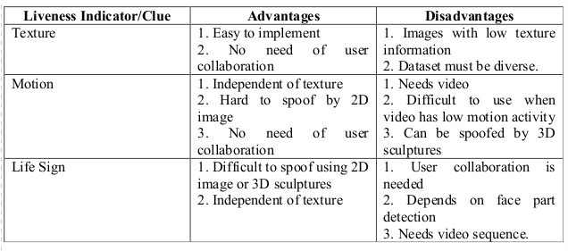

### Liveness Detection

### Project containing research methods for Liveness Detection

Link to article : https://arxiv.org/abs/1405.2227
Link to All Methods: [Methods ReadMe.md](https://github.com/afrozchakure/liveness-detection/blob/master/Github_methods.md)

### Discussed Methods in the paper for liveness detection
### 1. Frequency and Texture based analysis  
* They proposed a single image-based fake face detection method based on frequency and texture analyses for differentiating live faces from 2-D paper masks.
* The Power spectru based method for the frequency analysis, exploits both the low frequency information and the information residing in the high frequency regions.
* **Local binary Patterns (LBP)**: It is a powerful texture operator, for describing the micro-textures and their spatial informtion. The vectors in the feature space are then given as input to an SVM Classifier which determines whether the micro-texture pattern characterie a fake image or a live person.
* **Analysis of Fourier Spectra**: It is Based on structure and movement information of live face. Here ratio of energy of high frequency components to that of corresponding high frequency descriptor (HFD) is calculated. The HFD of live face should be more than a reasonable threshold Tfd.

### 2. Variable Focusing based analysis  
* The key is to utilize the variation of pixel values by focusing between two images sequentially taken in different focuses.
* In real faces, focused regions are clear and others are blurred due to depth information. In contrast, there is little difference b/w images taken in different focuses from a printed copy of a face, because they are not solid.
* **Sum Modified Laplacian(SML)** is used for focus value measurement. 
* **Depth of Field (DoF)** is the range of focus variations at pixels from sequentially taken images. It is crucially dependant on DoF and for better results, DoF should be made small.

### 3. Movement of the eyes based analysis  
* Proposes a modethod for detecting eyes in sequential input images and then variation of each eye region is calculated and whether the input face is real or not is determined.
* In this method, the liveness score of each eye region is calculated using the **Hamming distance method**. If the average liveness score is bigger than threshold, the input image is recognized as live face or else it is a photograph.

### 4. Optical Flow based analysis  
* It analyzes the differences and properties of optical flow generated from 3D objects and 2D planes. Optical flow is a combination of 4 basic movements: Translation, rotation, moving and swing.
* Optical flow allos to deduce the reference field, thus allows to determine whether the test region is planar or not.
For that, the difference among optical flow fields is calculated.
* Disadvantage is that illumination changes will have a negative impact on the results as the method is based on precise calculations of the optical flow field. It will fail for 3D objects.
* Another paper by Kollredier, is able to differentiate b/w motion of points and motion of lines. The trajectories of single parts of a live face are analyzed and that information can be used to decide whether its a real face or printed image. Here **model-based Gabor decomposition and SVM for detection of face parts** are used.

### 5. Blinking based analysis  
* It uses **Conditional Random Fields (CRFs)** for Blinking based analysis. They have used CRFs to model blinking activities, for accomodating long-range dependencies on the observation sequence.
* Blinking activity is an action represented by the image sequence which consists of images with close (C) and non-close (NC) state (include half-open and open).
* Using blinking database, the CRF-based blinking detection is compared with cascaded Adaboost and HMM approaches.

### Advantages:  
* It is non-intrusion, there is no requirement of extra hardware. It allows relaxing the assumption of conditional independence of the observed data.
### Disadvantages:
* It would be affected by glasses reflection, which may cover eyes.

### 6. Component Dependent Descriptor based analysis  
```It consists of four steps:   
(1) Locating the components of face  
(2) Coding the low-level features respectively for all the components  
(3) Deriving the high-level face representation by pooling the codes with weights derived from Fisher criterion  
(4) Concatenating the histograms from all components into a classifier for identification.
```  
* At first the detected face is expanded to obtain the Holistic-face (H-Face) which has 6 components - contour region, facial region, left eye region, right eye region, mouth region and nose region.
* Fisher ratio is used to describe the difference of micro textures between genuine faces and fake faces. Finally, the features are fed into a an SVM classifier.

### 7. 3D Face Shape based analysis  
* Makes use of a biometric system to differentiate real face from a photo thus reducing the vulnerability.
* It computes the 3D features of the captures face data to determine if there is a live face presented in front of the camera or not. Lack of surface variation in the scan is used to distinguish live images from photographs.
* Another method proposed by Wang uses the basic idea that structures from structues recovered from genuine faces usually contain sufficient 3D structure information, while structures from fake faces (photos) are usually planar.
### **Advantage:**  
The proposed approach is independent of device and can work with various inputs.
  
### 8. Binary Classification based analysis  
* Using the Lambertian model, they proposed two strategies to extract the essential information about different surface properties of a live human face or a photograph.
* The basic key is that the **brightness of the image captured from LCD screen affects the image in such a way that the high-frequency regions become prone to a “blurring” effect due to the pixels with higher values brightening their neighbourhood**. 
* This makes the fake images show less borders than the real face image.

### 9. Scenic Clues based analysis  
* It is a method which includes three scenic clues: non-rigid motion, face background consistency and imaging banding effect for accurate and efficient face liveness detection.
* Here face background consistency takes into consideration that the motion of face and background has high consistency for fake face images.
* They have implemented GMM based motion detection method for face-background consistency.

### 10. Lip Movement based analysis
* This method analyzes lip movements and lip reading for liveness detection.
* For classifiction of lip dynamics, SVM was used.
* The  proposed method achieves a recognition rate of 0.73 % out of 100 individuals.

### 11. Context based analysis
* The idea is that humans rely mainly on scene and context information during the detection of spoofing, the proposed algorithm tries to impersoate human behaviour and exploits scenic cues for determining whether there is a fake face presented in front of camera or not.
* The proposed method consists of a cascade of an Upper-Body (UB) and a spoofing medium (SM) detector which are based on histogram of oriented gradients (HOG) descriptors and linear support vector machines (SVM).

### 12. Combination of Standard Techniques based analysis
* The algorithm searches for faces and if the face is detected, a timer is started to define the period for collecting evidence.
* Evidence is collected for the liveness detection of the faces.
* For liveness detection, 3D properties or eye-blinking or mouth movements in non-interactive mode are being analyzed. 
* If no such response is found, reponses are asked and checked at random. After time period expires, it verifies the liveness of the face.

### Mainly 3 types of indicators are used:
1. Motion.
2. Texture.
3. Life Sign.

#### Motion
* It mainly differentiates motion pattern b/w 3D and 2D faces.
* Uses the face that planar objects move significantly different from real human faces which are 3-D objects. 
* Motion analysis usually depends on optical flow calculated from video sequences.

#### Texture analysis
* It takes advantage of detectable texture patterns such as print failures and overall image blur to detect attacks.
* The assumption is that fake faces are printed on paper and the printing process and paper structure that produce texture features can differentiate those printed images from real face images.

#### Life Sign
It is of 2 types:
* First one assumes certain known interaction from the user. The user needs to perform a certain task to verify the liveness of his face image.
* The second category, does not assume any interaction from user, but focuses on certain movements of certain parts of face, such as eye blinking, and will consider those movements as sign of life and therefore real face.

#### Advantages and Disadvantages of liveness detection approaches:  

